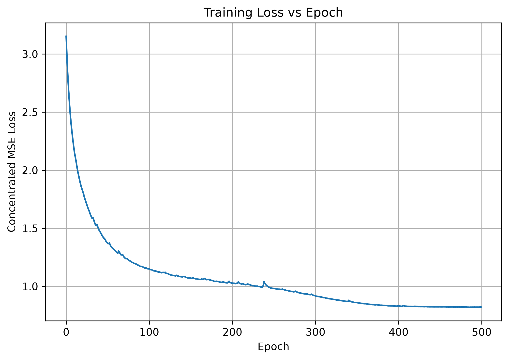
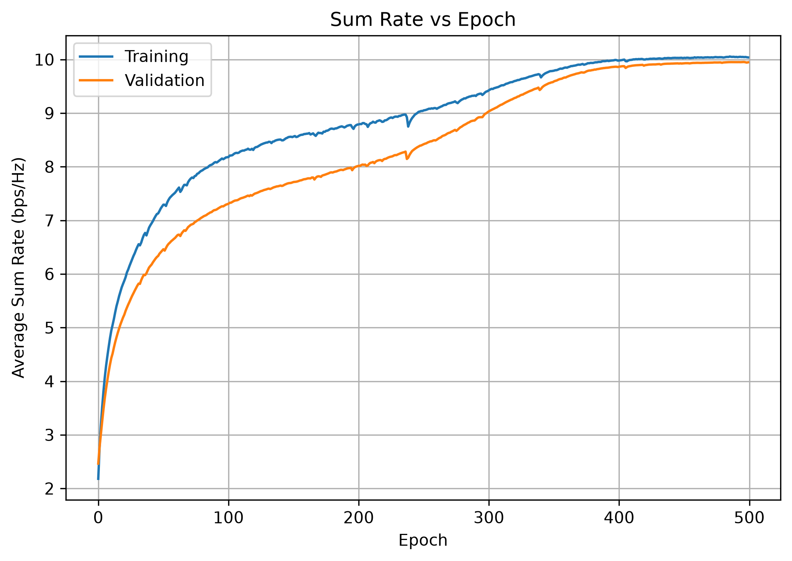
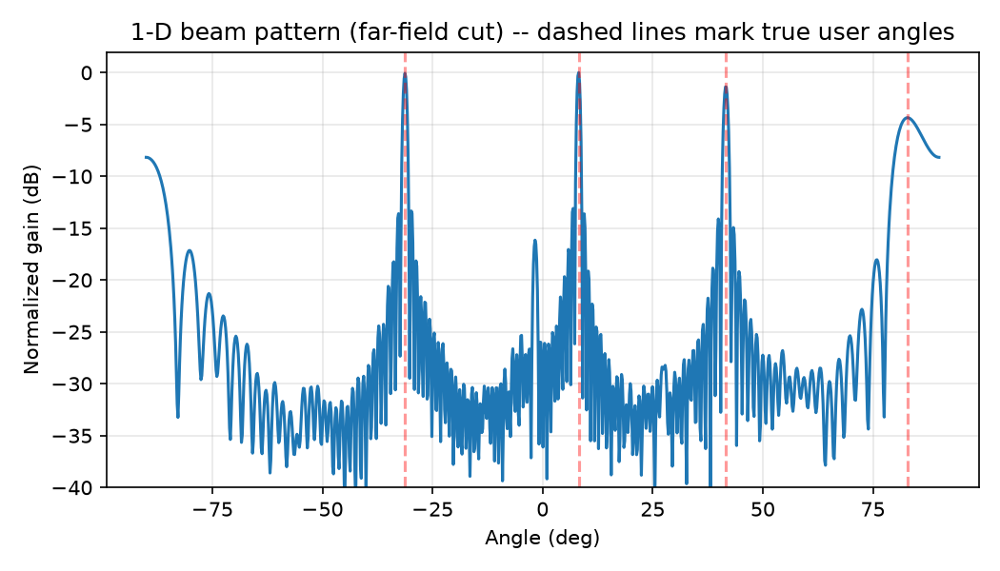

# Deep Learning Based Hybrid Beamforming.

This project is the first stage of a  hybrid beamforming system for multi-user communication.

The objective is to use a neural network to design the analog (RF) precoder instead of using conventional iterative methods. The digital (baseband) precoder is calculated separately using a KKT-based solution.

This stage only considers communication. No sensing or ISAC objective is included yet.

---

## 1. System Setup

The system consists of:

* `M = 128` transmit antennas
* `N_RF = 4` RF chains
* `K = 4` single-antenna users
* Carrier frequency: `100 GHz`
* Antenna spacing: `λ/2`
* Single-antenna users
* Near-field LoS-dominant channel
* User ranges between `5 m` and `80 m`
* Near-field boundary: approximately `R = 25 m`

The selected range includes both near-field and far-field users.

A spherical-wave channel model is used for all users instead of the far-field plane-wave approximation.

The transmitted signal is
\[
\mathbf{x}
=
\mathbf{F}_{\mathrm{RF}}
\mathbf{F}_{\mathrm{BB}}
\mathbf{s}
\]

where:

* $\mathbf{F}_{\mathrm{RF}}$ is the analog/RF precoder
* $\mathbf{F}_{\mathrm{BB}}$ is the digital/baseband precoder
* $\mathbf{s}$ is the transmitted data signal

The RF precoder has constant-modulus entries because it represents a phase-shifter-based hardware implementation.

The total transmit power is limited to $P_t$.

---

## 2. Neural Network

The neural network is called `MultiuserAnalogPrecoderNet`.

It takes the channel matrix

$$
\mathbf{H} \in \mathbb{C}^{M\times K}
$$

as input and produces the analog precoder

$$
\mathbf{F}_{\mathrm{RF}}
\in
\mathbb{C}^{M\times N_{\mathrm{RF}}}.
$$

The network only predicts the RF precoder. The digital precoder is calculated separately.

### Network structure

The main hidden layers use the following dimensions:

```text
512 → 256 → 128
```

The network uses complex-valued layers:

* `ComplexLinear`
* `ComplexBatchNorm`
* `ComplexTanh`

The final `CMNormalization` layer converts the network output into a constant-modulus RF precoder.

Each element satisfies

$$
\left|[\mathbf{F}_{\mathrm{RF}}]_{m,n}\right|
=
\frac{1}{\sqrt{M}}.
$$

Therefore, the output of the network already satisfies the RF phase-shifter constraint.

The network mainly needs to learn the appropriate phases of the RF precoder.

---

## 3. Digital Precoder Calculation

The network does not directly predict $\mathbf{F}_{\mathrm{BB}}$.

For a given RF precoder, the effective channel is calculated and the digital precoder is obtained using a KKT-based solution.

For user $k$, the MSE is written as

$$
\mathrm{MSE}_k =
1 -
\frac{
\left|
\mathbf{h}_k^H
\mathbf{F}_{\mathrm{RF}}
\mathbf{F}_{\mathrm{BB},k}
\right|^2
}{
\sum_j
\left|
\mathbf{h}_k^H
\mathbf{F}_{\mathrm{RF}}
\mathbf{F}_{\mathrm{BB},j}
\right|^2
+
\sigma_k^2
}.
$$

The objective is to minimize the sum MSE while satisfying the transmit power constraint.

For a fixed $\mathbf{F}_{\mathrm{RF}}$, the digital precoder is obtained from the KKT solution in the reduced `N_RF`-dimensional effective channel.

The solution is implemented using:

```python
torch.linalg.solve
```

This keeps the complete calculation differentiable during training.

---

## 4. Concentrated MSE

Since the digital precoder can be calculated for any given RF precoder, it does not need to be treated as another variable for the neural network to learn.

During training:

1. The channel matrix $\mathbf{H}$ is given to the neural network.
2. The network generates $\mathbf{F}_{\mathrm{RF}}$.
3. The effective channel is calculated.
4. The KKT solution is used to obtain $\mathbf{F}_{\mathrm{BB}}$.
5. The resulting MSE is calculated.
6. The loss is backpropagated through the complete calculation.

Therefore, the network only learns the RF precoder while the digital precoder is calculated for the current RF solution.

The resulting objective is referred to as the **concentrated MSE**.

This reduces the number of variables that the neural network needs to learn compared with directly learning both RF and baseband precoders.

---

## 5. Training Configuration

The training dataset contains:

```text
Total channel realizations : 20,000
Training set               : 70%
Validation set              : 15%
Test set                    : 15%
Batch size                  : 1024
Initial learning rate       : 7.5 × 10⁻⁴
Maximum epochs              : 500
Optimizer                   : Adam
```

A learning-rate scheduler is used when the validation loss stops improving.

Early stopping is also used with a patience of 50 epochs.

---

## 6. Training Results

### Training Loss



The concentrated MSE decreases from approximately `3.15` at the beginning of training to around `0.80`.

The training is generally stable, with a few small changes around epochs `230–250`, after which the loss continues to decrease.

The loss reaches a plateau at around `400` epochs.

### Sum Rate



The training and validation sum rates increase from approximately `2.3 bps/Hz` to around `10 bps/Hz`.

The training result remains slightly better than the validation result during most of the training.

The two curves become close to each other near the end of training, showing that the network is not showing a large difference between training and validation performance.

---

## 7. Test Set Comparison

The following results are obtained by averaging over the test set.

| Configuration                                                        | Avg Sum Rate (bps/Hz) |    Avg MSE |
| -------------------------------------------------------------------- | --------------------: | ---------: |
| Random $\mathbf{F}*{\rm RF}$ + ZF $\mathbf{F}*{\rm BB}$              |                0.1466 |     3.9019 |
| Random $\mathbf{F}*{\rm RF}$ + Random $\mathbf{F}*{\rm BB}$          |                0.3304 |     3.9675 |
| Matched Filter $\mathbf{F}*{\rm RF}$ + ZF $\mathbf{F}*{\rm BB}$      |                9.0242 |     3.9497 |
| Matched Filter $\mathbf{F}*{\rm RF}$ + Random $\mathbf{F}*{\rm BB}$  |                1.4009 |     3.8805 |
| Matched Filter $\mathbf{F}*{\rm RF}$ + KKT $\mathbf{F}*{\rm BB}$     |               10.0851 |     0.8190 |
| **Neural Network $\mathbf{F}*{\rm RF}$ + KKT $\mathbf{F}*{\rm BB}$** |            **9.9044** | **0.8469** |
| Full Digital $\mathbf{F}*{\rm RF}$ + ZF $\mathbf{F}*{\rm BB}$        |               10.0851 |     0.8190 |
| SOMP $\mathbf{F}*{\rm RF}$                                           |                8.2772 |     1.3294 |

The neural network achieves an average sum rate of:

$$
\boxed{9.9044\ \text{bps/Hz}}
$$

The best result in the table is:

$$
10.0851\ \text{bps/Hz}
$$

Therefore, the neural network is approximately `1.8%` below the best result.

It also performs better than the SOMP + TH-HMP method:

$$
9.9044 > 8.2772\ \text{bps/Hz}.
$$

This shows that the trained network can obtain a good RF precoder without running the iterative SOMP procedure for every channel realization.

### Note

The Matched Filter + KKT and Full Digital + ZF configurations give exactly the same values in the current implementation.

---

## 8. Beam Pattern



The figure shows an example test channel.

The user parameters for this example are:

```text
Angles = [29.59°, 79.12°, 49.43°, 79.43°]

Ranges = [40.18 m, 50.51 m, 78.06 m, 38.54 m]
```

The obtained performance is:

```text
Sum rate = 8.0726 bps/Hz
MSE      = 1.0259
```

The beam pattern shows peaks around the directions of the four users.

The strongest peak is around `50.72°`, which is close to the user at `49.43°`.

The sidelobes are generally around `15–30 dB` below the main peaks.

The general MSE and concentrated MSE give the same result for this example, which confirms that the KKT-based digital precoder calculation is being used consistently.

---

## 9. Inference Time

The inference time of the neural network is compared with the conventional SOMP method.

The measurements are averaged over `500` channel realizations.

Here, one sample means one multi-user channel matrix $\mathbf{H}$.

| Method         | Average inference time |
| -------------- | ---------------------: |
| Neural Network |  **10.5867 ms/sample** |
| SOMP           | **704.1061 ms/sample** |

The neural network requires approximately:

$$
10.59\ \text{ms/sample}
$$

while SOMP requires approximately:

$$
704.11\ \text{ms/sample}.
$$

Thus, the neural network is much faster during inference for the tested configuration.

The main difference is that SOMP performs an iterative optimization for each channel realization, whereas the trained neural network generates the RF precoder using a single forward pass.

---

## 10. Main Results

The main observations from Stage 1 are:

* The neural network can directly generate a constant-modulus RF precoder from the channel matrix.
* The digital precoder can be calculated separately using the KKT solution.
* The concentrated MSE approach allows the network to focus only on the RF precoder.
* The proposed neural network achieves `9.9044 bps/Hz` average sum rate.
* The best result in the current comparison is `10.0851 bps/Hz`.
* The neural network is approximately `1.8%` below the best result.
* The neural network performs better than the SOMP + TH-HMP baseline.
* The neural network inference time is approximately `10.59 ms/sample`, compared with `704.11 ms/sample` for SOMP.
* The constant-modulus constraint is satisfied directly by the network output.
* The current results provide the communication-only base for the next stage of the project.

---

## 11. Next Stage

Stage 1 focuses only on multi-user communication.

The next stage can extend the system toward near-field ISAC by adding a sensing target and incorporating sensing-related objectives into the beamforming design.

The communication performance obtained in this stage will be used as the baseline for comparison with the later ISAC-based designs.
