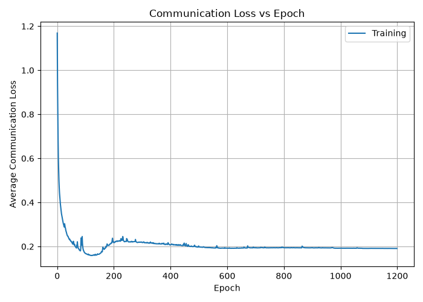
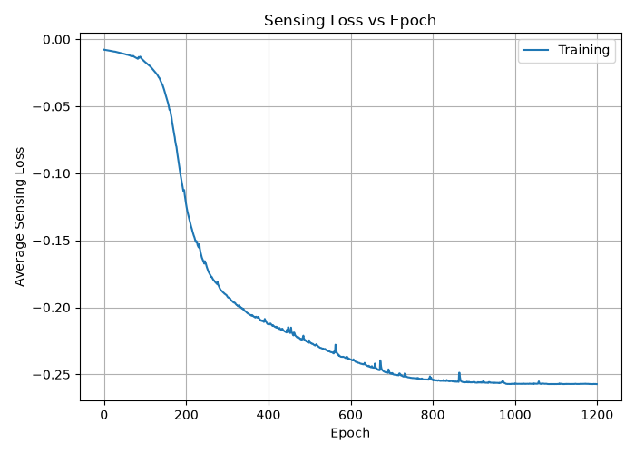
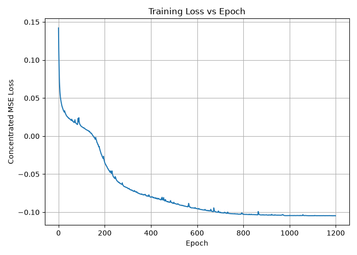
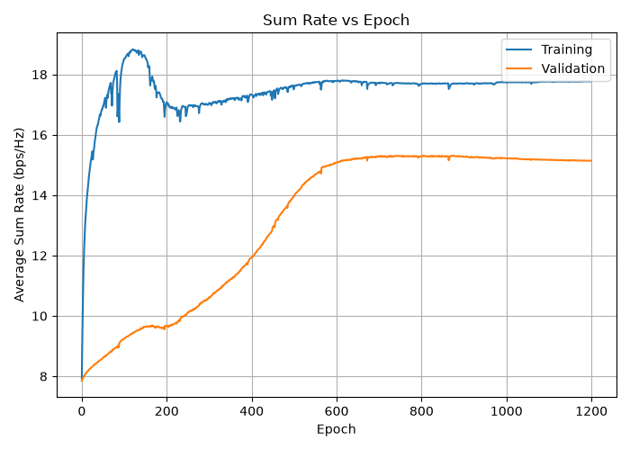
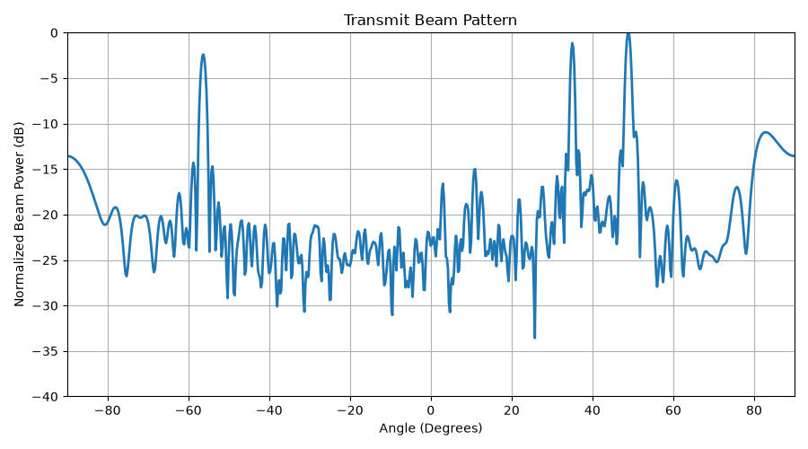
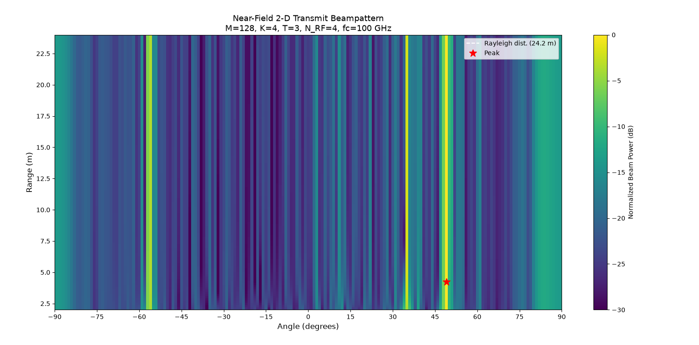

# Deep Learning Hybrid Beamforming — Stage 2 (ISAC Extension)

Stage 2 extends the Stage 1 communication-only system to joint communication and sensing (ISAC).

The same neural network used for the analog precoder in Stage 1 is now used to serve the communication users and also focus power toward near-field sensing targets.

The system parameters such as the number of antennas, RF chains, carrier frequency, and antenna spacing remain the same as Stage 1.

---

## 1. What is Changed from Stage 1?

|                 | Stage 1                         | Stage 2                                                           |
| --------------- | ------------------------------- | ----------------------------------------------------------------- |
| Input           | $\mathbf{H}$ only ($M\times K$) | $\mathbf{H}_{\rm aug}=[\mathbf{H},|,\mathbf{B}]$ ($M\times(K+L)$) |
| Targets         | None                            | $L=3$ near-field sensing targets                                  |
| Network columns | $K=4$                           | $K+L=7$                                                           |
| Merge layer     | ComplexLinear(512→512)          | ComplexLinear(896→512)                                            |
| Loss            | Communication loss only         | $\lambda L_{\rm com}+(1-\lambda)L_{\rm sen}$                      |

The main change is that the network now receives information about both the communication users and the sensing targets.

---

## 2. Sensing Targets

Three fixed sensing targets are used in this stage.

| Target |       Angle | Range |
| ------ | ----------: | ----: |
| 1      |   $0^\circ$ |  15 m |
| 2      |  $30^\circ$ |  25 m |
| 3      | $-20^\circ$ |  40 m |

The targets remain fixed for all training samples. The communication channel $\mathbf{H}$ changes from one sample to another.

For each target, a near-field array response vector is calculated as

$$
\mathbf{b}_\ell
=
\mathbf{a}_{\rm nf}(\theta_\ell,r_\ell).
$$

The same near-field array response used in the channel model is used for the sensing targets.

For this system, the Rayleigh distance is approximately `24.2 m`.

Therefore:

* Target 1 at `15 m` is inside the near-field region.
* Target 2 at `25 m` is just outside the near-field boundary.
* Target 3 at `40 m` is in the far-field region.

This allows the system to include targets on both sides of the near-field boundary.

---

## 3. Input to the Network

In Stage 1, the network only received the communication channel:

$$
\mathbf{H}\in\mathbb{C}^{M\times K}.
$$

In Stage 2, the target steering vectors are added to the input.

Let

$$
\mathbf{B}
=
[\mathbf{b}_1,\mathbf{b}_2,\mathbf{b}_3].
$$

The communication channel and target matrix are concatenated column-wise:

$$
\mathbf{H}_{\rm aug}
=
[\mathbf{H}\,\|\,\mathbf{B}].
$$

Since there are `K = 4` users and `L = 3` targets,

$$
\mathbf{H}_{\rm aug}
\in
\mathbb{C}^{M\times7}.
$$

The network therefore processes seven input columns: four communication channels and three target steering vectors.

---

## 4. Network Architecture

The main network structure from Stage 1 is kept unchanged.

Each input column is processed using the same ComplexMLP:

```text
128 → 512 → 256 → 128
```

The layers used are:

* `ComplexLinear`
* `ComplexBatchNorm`
* `ComplexTanh`

The same network weights are used for all seven columns.

After processing, each column produces a `128`-dimensional feature vector.

The seven feature vectors are then concatenated:

$$
7\times128=896.
$$

This `896`-dimensional vector is passed through the merge layer:

```text
ComplexLinear(896 → 512)
```

This is the main architecture change from Stage 1, where the merge layer was:

```text
ComplexLinear(512 → 512)
```

The output is then reshaped and converted into the constant-modulus RF precoder $\mathbf{F}_{\rm RF}$, as in Stage 1.

---

## 5. Loss Function

Stage 2 has two objectives:

1. Communication performance
2. Sensing performance

The total loss is

$$
\mathcal{L}
=
\lambda L_{\rm com}
+
(1-\lambda)L_{\rm sen}.
$$

The communication loss is the same concentrated-MSE loss used in Stage 1.

The sensing loss is added to encourage the transmit beamformer to send more power toward the selected sensing targets.

---

## 6. Communication Loss

The communication loss $L_{\rm com}$ is unchanged from Stage 1.

The digital precoder $\mathbf{F}_{\rm BB}$ is still obtained using the KKT solution for the RF precoder produced by the neural network.

Therefore,

$$
\mathbf{F}_{\rm BB}
=
\mathbf{F}_{\rm BB}
(\mathbf{F}_{\rm RF},\mathbf{H}).
$$

The communication part of the system is therefore handled in the same way as Stage 1.

---

## 7. Sensing Loss

The sensing part uses the effective transmit matrix

$$
\mathbf{TX}
=
\mathbf{F}_{\rm RF}
\mathbf{F}_{\rm BB}.
$$

For target $\ell$, the received transmit power is calculated as

$$
\left\|
\mathbf{b}_\ell^H
\mathbf{TX}
\right\|^2.
$$

The sensing loss is defined as

$$
L_{\rm sen}
=
-\frac{1}{L}
\sum_{\ell=1}^{L}
\left\|
\mathbf{b}_\ell^H
\mathbf{TX}
\right\|^2.
$$

The negative sign is used because the loss is minimized during training. Therefore, minimizing $L_{\rm sen}$ increases the power directed toward the sensing targets.

There is no separate sensing-only data stream in this implementation. The sensing power comes from the same transmit beams that are used for communication.

---

## 8. Digital Precoder During Sensing Training

An important part of this stage is how the digital precoder is handled during the sensing loss calculation.

The KKT solution still calculates the communication-optimal $\mathbf{F}*{\rm BB}$ for the current $\mathbf{F}*{\rm RF}$.

However, the KKT calculation is performed inside:

```python
torch.no_grad()
```

Therefore, the sensing loss does not backpropagate through $\mathbf{F}_{\rm BB}$.

The sensing gradient only updates the RF precoder:

$$
L_{\rm sen}
\rightarrow
\mathbf{F}_{\rm RF}
\rightarrow
\text{Neural Network}.
$$

The digital precoder continues to be used for communication and interference suppression.

This means that the communication and sensing trade-off is handled mainly through the `N_RF = 4` RF precoder.

---

## 9. Loss Normalization

The communication and sensing losses have very different numerical values.

The communication loss is roughly in the range:

$$
L_{\rm com}\approx1\text{ to }4
$$

while the sensing loss is much smaller.

Therefore, directly using

$$
\lambda L_{\rm com}
+
(1-\lambda)L_{\rm sen}
$$

would give much more importance to the communication loss.

To avoid this, both losses are normalized first:

$$
L_{\rm com}^{\rm norm}
=
\frac{L_{\rm com}}{K}
$$

and

$$
L_{\rm sen}^{\rm norm}
=
\frac{L_{\rm sen}}{-P_t}.
$$

The final loss is

$$
\mathcal{L}
=
\lambda L_{\rm com}^{\rm norm}
+
(1-\lambda)L_{\rm sen}^{\rm norm}.
$$

For this stage,

$$
\lambda=0.5.
$$

Therefore, communication and sensing are given equal weight.

When $\lambda=1$, the system becomes the Stage 1 communication-only system. When $\lambda=0$, only the sensing objective is considered.

---

## 10. Training

The training setup is similar to Stage 1.

The system uses:

* Adam optimizer
* Plateau-based learning-rate scheduling
* Gradient clipping with maximum norm `5.0`
* Maximum `1200` epochs

The training is longer than Stage 1 because the network now has to optimize both communication and sensing objectives.

---

## 11. Training Results

### Communication Loss



The normalized communication loss starts at approximately `1.17` and decreases to around `0.19–0.20`.

There is a small increase around epochs `200–250`, which can be caused by the sensing objective affecting the communication objective during the early part of training.

The final normalized communication loss corresponds to an overall communication MSE of approximately `0.8` after multiplying by `K = 4`.

This is close to the communication MSE obtained in Stage 1.

### Sensing Loss



The sensing loss decreases from approximately `0` to around `-0.26`.

The loss becomes stable after roughly `800–1000` epochs.

Since the sensing loss is negative, a lower value means that more transmit power is being directed toward the sensing targets.

### Combined Loss



The combined loss decreases and reaches approximately `-0.105`.

The negative value is expected because the normalized sensing loss is negative.

The plot is currently labeled `"Concentrated MSE Loss"`, which was carried over from Stage 1. For Stage 2, this should be changed to something such as:

```text
Combined ISAC Loss
```

because the plotted quantity now contains both communication and sensing terms.

### Sum Rate



The training sum rate increases quickly to around `18.8 bps/Hz` and then settles around `17.7–17.8 bps/Hz`.

The validation sum rate increases more slowly and reaches approximately:

$$
15.2-15.3\ \text{bps/Hz}.
$$

There is a persistent difference of around `2.5 bps/Hz` between training and validation performance.

This should be investigated further before comparing the Stage 1 and Stage 2 results directly.

In particular, the user range used in both stages should be checked. If the range of communication users is different between the two experiments, then the sum-rate values may not be directly comparable.

---

## 12. Beam Patterns

### 1-D Far-Field Beam Pattern



The first plot shows a 1-D angular cut of the transmit beam pattern.

The four main peaks are approximately aligned with the user/target angles.

However, this plot uses a far-field steering vector to examine a system that contains near-field users and targets.

Therefore, it does not provide a complete picture of the near-field focusing behavior.

The plot can be used as a basic check, but the 2-D range-angle pattern is more useful for this system.

### 2-D Near-Field Beam Pattern



The 2-D beam pattern shows transmit power as a function of both angle and range.

This is more suitable for studying the near-field system because near-field beamforming depends on both angle and distance.

The current result shows strong power around certain angles, but the power does not form clear peaks at the three target ranges:

```text
15 m
25 m
40 m
```

Instead, some of the patterns extend across a large part of the range axis.

One possible reason is the current sensing loss. The sensing loss only rewards the power at the exact target locations:

$$
(\theta_\ell,r_\ell).
$$

It does not directly penalize power at other ranges.

Therefore, the network has no direct reason to suppress power at nearby ranges.

If range focusing is an important part of the sensing objective, a range-selectivity term should be added to the sensing loss. This could penalize power at incorrect ranges around the target.

---

## 13. Stage 1 vs Stage 2

|                           | Stage 1            | Stage 2 ($\lambda=0.5$) |
| ------------------------- | ------------------ | ----------------------- |
| Objective                 | Communication only | Communication + sensing |
| Number of sensing targets | 0                  | 3                       |
| Validation sum rate       | ~9.9 bps/Hz        | ~15.2–15.3 bps/Hz*      |
| Communication MSE         | ~0.85              | ~0.8                    |
| Train/validation gap      | Small              | ~2.5 bps/Hz             |

*The Stage 1 and Stage 2 sum-rate values should not be directly compared until the user range used in both experiments has been confirmed.

---

## 14. Current Issues to Check

Before using these results in the final report or paper, the following points should be checked:

1. Confirm that Stage 1 and Stage 2 use the same user range.
2. Investigate the training and validation sum-rate difference in Stage 2.
3. Check whether the sensing loss needs an additional range-selectivity term.
4. Change the combined-loss plot label from `"Concentrated MSE Loss"` to `"Combined ISAC Loss"`.
5. Replace the 1-D far-field beam pattern with a near-field-based plot, or use the 2-D range-angle pattern as the main beam-pattern result.

---

## 15. Inference Time

The inference-time comparison between the neural network and SOMP has not yet been completed for Stage 2.

The current README only carries over the Stage 1 inference-time section.

The measurement will be added after running the comparison for the Stage 2 network.

---

## 16. Summary

Stage 2 extends the communication-only beamforming system from Stage 1 to an ISAC system.

The main changes are:

* Three near-field sensing targets are added.
* Target steering vectors are provided as additional network inputs.
* The network processes four communication channels and three target vectors.
* A sensing loss is added to the communication loss.
* The KKT-based digital precoder is still used for communication.
* The sensing gradient is applied only through the RF precoder.
* Communication and sensing losses are normalized before combining them.
* The current results show that communication performance remains around the Stage 1 level while also optimizing the sensing objective.
* The current 2-D beam pattern shows angle focusing, but stronger range selectivity may require a modified sensing loss.

This stage provides the communication-and-sensing base for further work on near-field ISAC beamforming.
